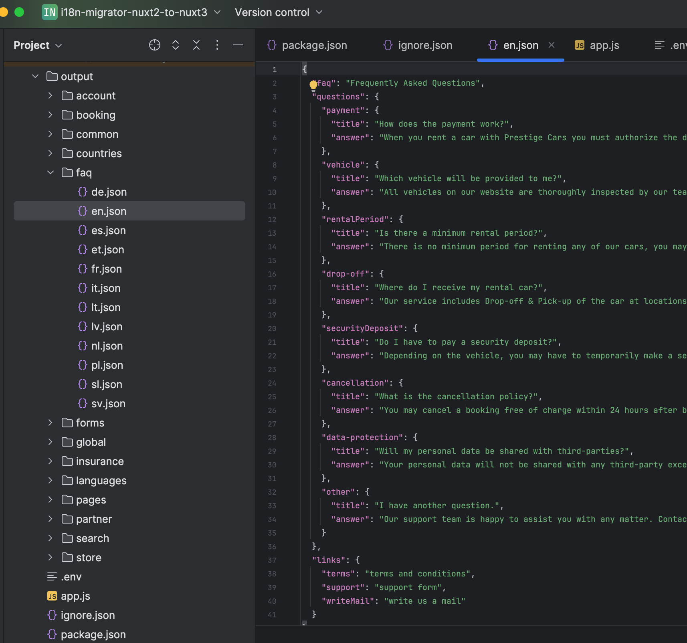

# i18n Migrator - Nuxt2 to Nuxt3
##### Just a small helper app for migrating modular i18n from Nuxt2 to Nuxt3.

Some Nuxt2 projects using i18n utilized a modular file structure where translations for different languages were organized into separate directories. This tool helps you migrate from the old Nuxt2 structure to the new Nuxt3 structure, where language files are grouped by the component or module they belong to.

### Example
##### Before Migration (Nuxt2 Structure)
```
i18n/
├── de/
│   ├── account.json
│   ├── about.json
│   └── partner/
│       └── booking.json
├── en/
│   ├── account.json
│   ├── about.json
│   └── partner/
│       └── booking.json
```

##### After Migration (Nuxt3 Structure)
```
output/
├── account/
│   ├── de.json
│   └── en.json
├── about/
│   ├── de.json
│   └── en.json
└── partner/
    └── booking/
        ├── de.json
        └── en.json
```

### How to run
1. Specify target directory in `.env` file.

2. Install dependencies
```bash
pnpm install
```

3. Run App
```bash
pnpm start
```

### Example output
